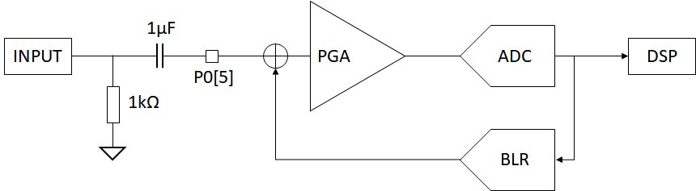
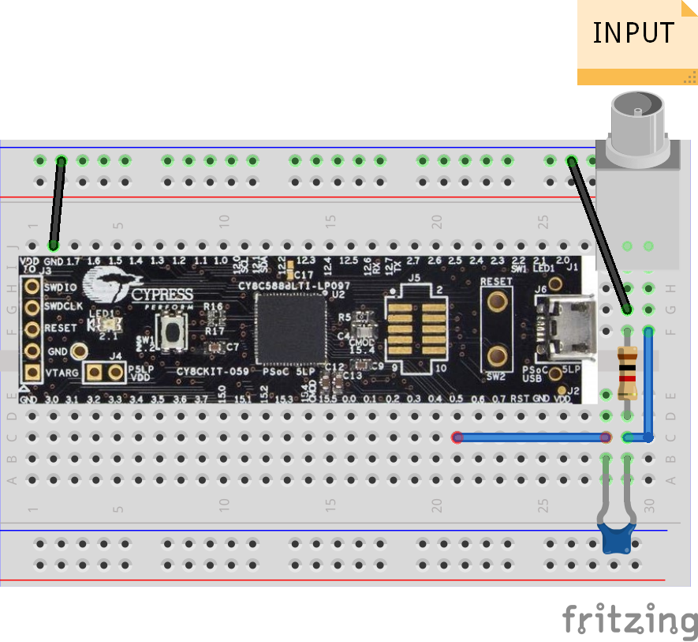
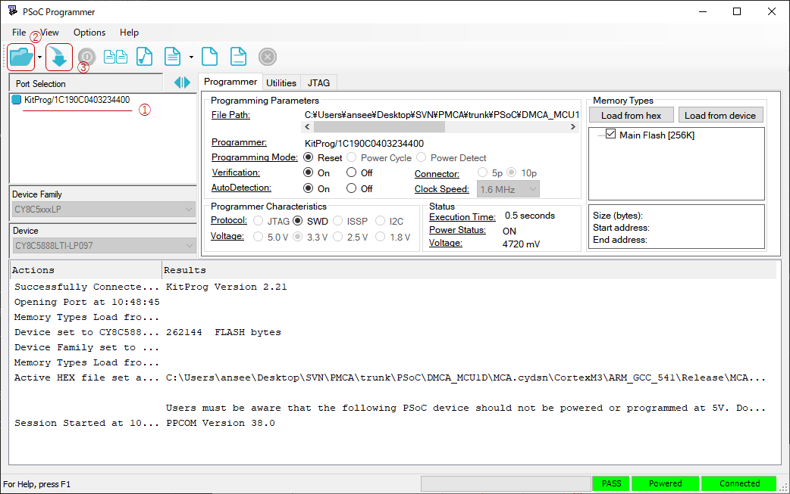
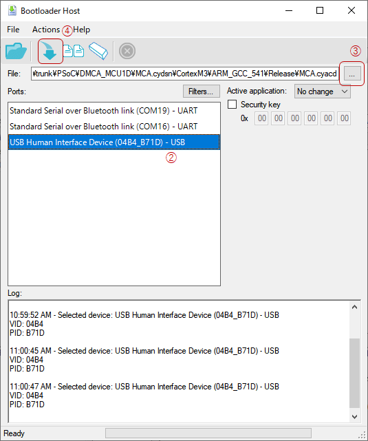
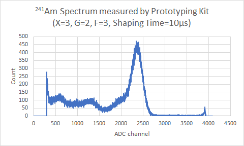
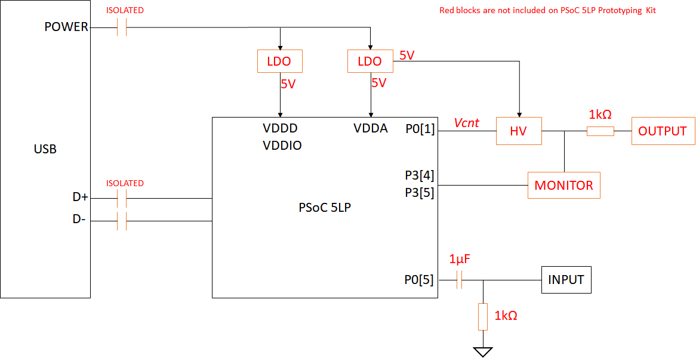
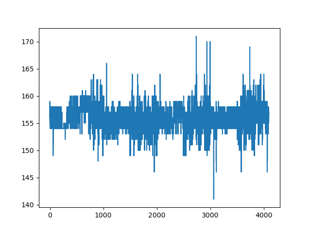
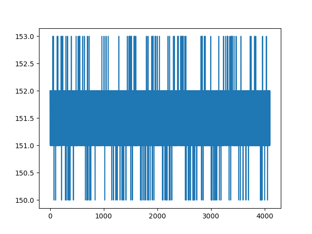

# ポケットMCA（PSoC）
ポケットMCA（PSoC）（以下PMCA）は、PSoC 5LPを用いた簡易Multi Channel Analyzer (MCA)です。
MCA機能をPSoC内のブロックで構成し外付け部品を極力廃しているため、[CY8CKIT-059 PSoC® 5LP Prototyping Kit](https://www.cypress.com/documentation/development-kitsboards/cy8ckit-059-psoc-5lp-prototyping-kit-onboard-programmer-and)に1μFの容量と1kΩの抵抗を加えることでMCAとして動作します。

## 入力信号経路


この図はPSoC内を含めた入力信号経路を示しています。
AC結合された入力信号はPGA（Programmable Gain Amplifier）で増幅した後、ADCでデジタル化されます。
デジタル化された信号は後段のDSP（Digital Signal Processing）ブロックに渡され、波高値情報が抽出されます。
並行してBLRブロックにもデジタル値が渡され、PGAの入力にフィードバックすることでベースライン電位が再設定されます。


Prototyping KitでMCAを構成する場合には、図のように1μFの容量と1kΩの抵抗を入力端子に接続してください。

## 仕様

|項目|値|補足|
|:--|:--|:--|
|電源電圧|5V±0.25V|USBハイパワーポートの範囲（4.75V~5.25V）|
|消費電流（MCA)|20mA||
|入力電圧範囲|±10V|AC結合容量に依存|
|信号電圧範囲|±2Vpp max.|ゲイン2倍時|
|ピークタイム|10μs以上|満たない場合でも測定は可能|
|最大カウントレート|100kcps||

## 使い方
PMCA用の[ファームウェア書き込み](#HEXファイル書き込み)後、Windows PCとUSBケーブルで接続することでCOMポートとして認識されます。
そのCOMポートに対してASCIIコードを送ることでPMCAと対話でき、動作の変更や測定が行えます。
最初のアルファベットでコマンド種別を選択し、続く16進数（0~F）で設定値を指定します。
設定値がある場合は制御コマンド、ない場合は読み出しコマンドとして判断されます。
最初のアルファベット、コマンド指定以降の16進数以外は無視されます。

コマンドの例

```
SA # 10秒の測定を開始
S A # 上と同じ
V 3FC # HVを1020Vに設定
V # HV出力のモニタ結果を読み出す
```

PCから送信するコマンドの終端は改行（CR）です。
PMCAから送信するデータの終端は4 byte NULL（0x00000000）となっており、NULL終端文字列として取り込めます。
実際には端末エミュレータ互換のためNULLの前に改行（CR）が存在します。
加えて、データの成否を表す'OK/NG'の文字列が追加されるため、実質的な終端は7 byteになります。

### サンプルスクリプト
example.pyとexample_gui.pyがそれぞれCUI、GUIのサンプルスクリプトです。
必要な外部パッケージは以下のとおりです。

- pySerial
- numpy
- matplotlib

### 測定結果について
'S'コマンドで測定を開始すると1秒おきに測定結果が出力されます。
結果は2次元ヒストグラム（横軸：ADCチャネル、縦軸：頻度）のバイナリデータ（16 bit × 4096 ch）と終端7 byteです。
データ中の終端NULLを回避するため頻度値は測定値+1で表されます。

### 制御コマンド一覧

コマンド | 制御対象 | 設定範囲 | 詳細
------------- | ------ | ------------ | ------
A | | | 予約
B | | | 予約
C | | | 予約
D | ベースライン電圧 | 0~4080 | mVで指定。通常は自動で最適値に設定される。強制上書き用
E | 測定強制終了 | | 測定を即時終了させる
F | フィルタ | 0~3 | ADC測定値に対する指数移動平均数の指定。指数移動平均係数α=2/(N+1)に対して、0:N=1, 1:N=3, 2:N=7, 3:N=15。
G | ゲイン | 2~16 | ゲインが設定値倍となる。
H | ハードウェア情報 | | ハードウェア情報を送信するようリクエストを送る（非推奨）
I | ADC | 0 or 1 | 設定値が1の時、計測されたデジタル値の符号を反転する（負パルス用）
J | | | 予約
K | | | 予約
L | LLD/ULD | 0~4095 | 上位2bitで設定対象を指定（0b00:LLD, 0b01:ULD, 0b02:予約, 0b03:予約)。下位12bitで設定値を指定（パルス高ウィンドウ[ch]）。
M | 信号モニタ | | モニタ機能として予約
N | | | 予約
O | HV | 0 or 1 | 0: OFF, 1: ON
P | | | 予約
Q | | | 予約
R | | | 予約
S | 測定開始 | 0~2^16-1 | 測定時間[秒]を指定して測定を開始する
T | | | 予約
U | | | 予約
V | HV出力電圧 | 0~1020 | Vで指定。
W | | | 予約
X | 波高値計測アルゴリズム | 0～3 | 0:高速判定、1:立ち上がり高速＋上ピークホールド、2: 上下ピークホールド、3:BLR基準
Y | DSP | 0 or 1 | 0: OFF, 1:ON
Z | | | 予約

## 読み出しコマンド一覧

コマンド | 対象 | 戻り値 | 詳細
------------- | ------ | ------------ | ------
A | | | 予約
B | BLR | 0~4080 | BLRにより設定しようとしているベースラインのADCチャネル値を返します。
C | | | 予約
D | BLR | 正負の整数 | BLRにより加えたオフセットチャネル数を返します。
E | | | 予約
F | | | 予約
G | | | 予約
H | PMCA | 文字列 | PMCAの初期化処理を実行し、ハードウェア情報を文字列で返します。
I | | | 予約
J | | | 予約
K | | | 予約
L | | | 予約
M | | | 予約
N | | | 予約
O | | | 予約
P | | | 予約
Q | | | 予約
R | | | 予約
S | | | 予約
T | | | 予約
U | | | 予約
V | HVモニタ | 電圧値 | HV出力のモニタ結果を電圧で返します。
W | | | 予約
X | | | 予約
Y | | | 予約
Z | PMCA | なし | Bootloaderを起動します。PSoC CreaterのBootloader Host機能から新しいファームウェアを書き込むことが出来ます。

# ファームウェア書き込み
最初の1回のみPSoC Programmerを使いHEXファイルを書き込みます。
このときはPrototyping KitのKitProg側USB端子を使用する必要があります。
HEXファイル書き込み以降は'Z'コマンドでBootloaderに入ることでmicro USB端子からファームウェアを更新出来ます。

## HEXファイル書き込み
PSoC Programmerを用い、Prototyping KitのKitProg経由でHEXファイルを書き込みます。
HEXファイル書き込み後COMポートとして認識されMCAとして動作します。
HEXファイルにcyacdファイルが含まれているため[cyacdファイルの書き込み](#ファームウェア更新)は不要です。

1. KitProgを選択
1. 書き込むHEXファイルを指定
1. 書き込み実行



## ファームウェア更新
通常使用時と同じくmicro USB端子経由でUSB接続します。
COMポートに接続し、'Z'コマンドを送信してbootloaderに入ります。
PSoC Createorのメニュー[Tools] -> [Bootloader Host...]からBootloader Hostを起動しcyacdファイルを書き込みます。

1. 'Z'コマンドでBootloaderに入る（pythonやTera Term等を使用）
1. Bootloader HostでUSB Human Interface Deviceを選択
1. 更新用のcyacdファイルを指定
1. 書き込み実行



# 測定例

## <sup>241</sup>Am


# ANS-PMCAについて
ポケットMCA用にPSoC 5LP基板をおこしたものがANS-PMCAになります。
ANS-PMCAにはMCA機能に加え、

- 高電圧出力（+/-1000V）
- 電源およびUSB通信の絶縁

が備わります。


この図はANS-PMCAのブロック図を示しています。
赤で示した箇所がANS-PMCA版で追加される機能です。
電源はUSBバスパワーから供給されますが、絶縁した後にデジタル/アナログそれぞれLDOで分離されます。
高電圧生成器（HV）の制御はPSoCから行われ、SHVコネクタから出力されるとともにPSoCのDelta Sigma ADCにより電圧がモニタされます。
入力は1μFの容量でDC成分が除去され、PSoC内部ではBLR（Base Line Restorer）機能により適切なベースライン電位が再設定されます。

Prototyping Kitを用いたPMCAとの機能的な違いはHVブロックの有無です。
回路的にはUSBの絶縁、高電圧生成回路、高電圧モニタ回路、入力容量、負荷抵抗、電源回路の有無が異なり、雑音特性が改善されています。
例えば、無信号時の波形において電圧雑音がPrototyping Kitを用いたPMCAでは3.0 [ch rms]なのに対して、ANS-PMCAでは0.6 [ch rms]と1/5に改善されています。

## Prototyping Kitを用いたPMCAの無信号波形


## ANS-PMCAの無信号波形

